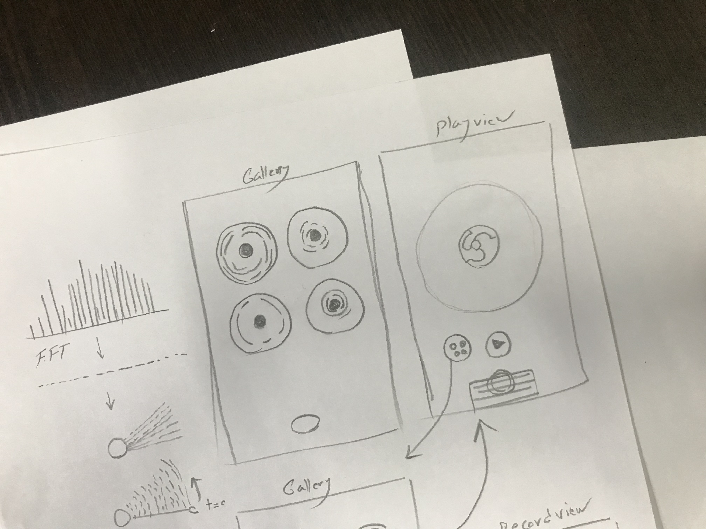
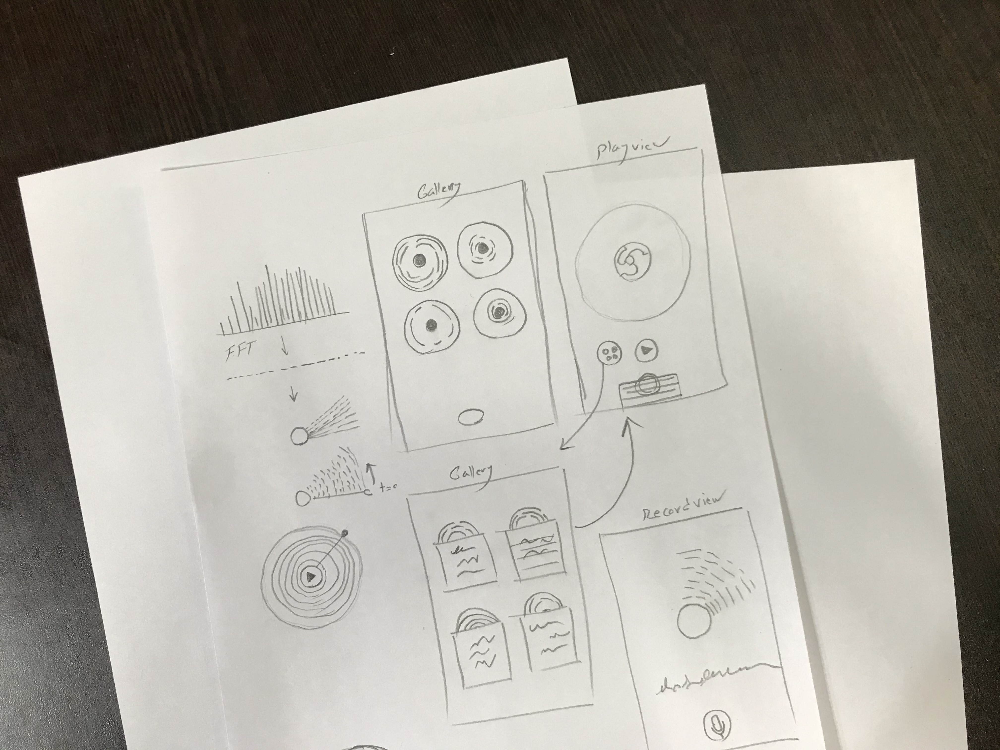
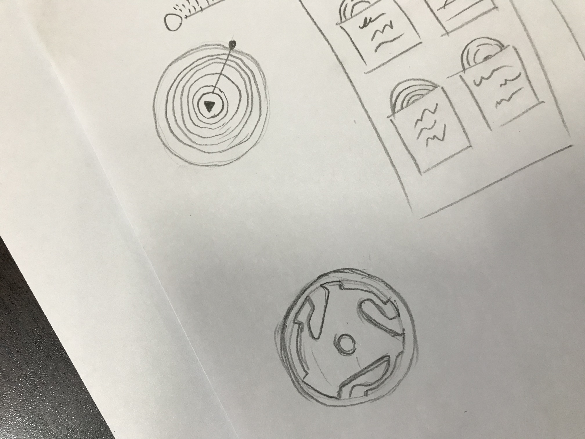
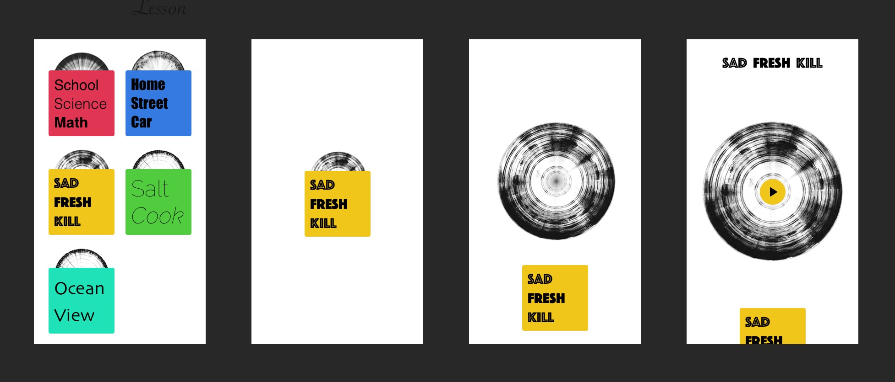
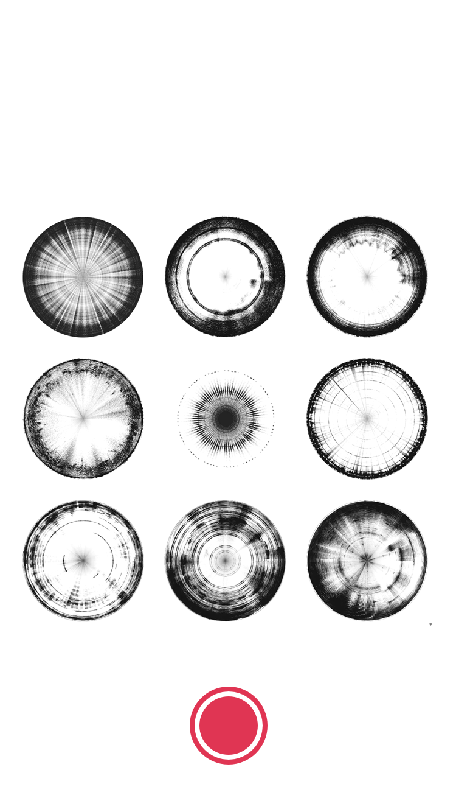
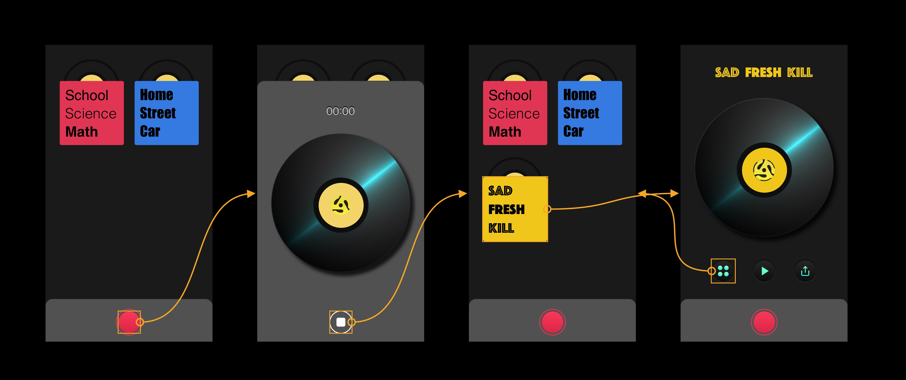

# Design

## Wireframes

    
    
    

## Artboard

    

## Visual Concepts

    

## Transition Animation

See the transition from [gallery-transition-animation.mov](./gallery-transition-animation.mov) file.

## Final Flow

    

## App Icon

    

## Apple Watch Application

    

