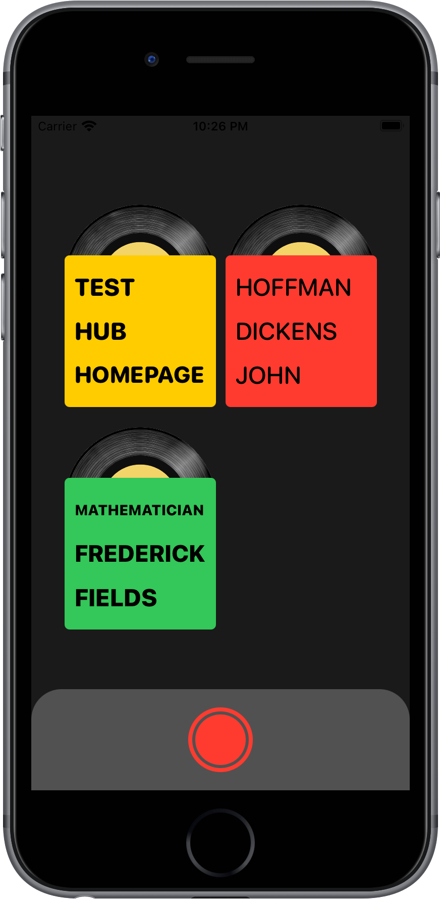

# Specto

<p style="margin-top: 24px">

</p>

**Specto** is an audio visualizer application that also transcribes user input using Apple speech recognition API. Each recording session is tagged with highlighted keywords by the TextRank algorithm. Designed and developed by Taha Mousavi, Abbas Mousavi and Moeen Zamani for SwiftUI Jam, Feb 2021.

## Setup

This project uses both Cocoapods and SwiftPM due to dependency issues. Install Cocoapods dependencies using:

```bash
    pod install
```

Open `Specto.xcworkspace` and Xcode will take care of SwiftPM dependencies.

## Architecture

Right now an approach similar to MVVM is taken for the application architecture. All shared states between views is handled by the `AppModel` object which can be shared using `EnvironmentObject` property wrapper. Individual states for views are managed by corresponding view model object. View model objects also take control of actions which lead to state changes. Each view then subscribes to view model changes by using the `ObservedObject` property wrapper.

## Views

Specto consists of four main views that we go over briefly here:

- RootView
- GalleryView
- PlayView
- RecordView

### RootView

**RootView** is the container view which holds `GalleryView` and `PlayView`. Content is displayed along with the sticky record pane displayed at the bottom.

### GalleryView

**GalleryView** is the library view which displays all recording sessions. `matchedGeometryEffect` modifier is used for the zooming animation.

<p float="left" style="margin-top: 32px">


</p>

### RecordView

**RecordView** is the responsible one for starting and storing a session. It holds the `AudioVisualizer` view which uses fast fourier transforms to project calculated paths over the spinning LP record. The TextRank algorithm is applied at the end of the session to detect verbal context.

`AudioVisualizer` view uses angular gradients to project the FFT to concentric circle paths. The whole image shows 50 FFTs calculated five times per second each with 33 components which makes 1650 visual components in total. We started with multiple curves in different colors but that implementation was slow, so we switched to angular gradients producing smoother graphics with much better performance. We also use `.drawingGroup()` for better performance.

<p style="margin-top: 32px">

</p>

### PlayView

**PlayView** is responsibe for playing a recording session. At the end of each session, the resulting visual is stored as an image which will be displayed during playback. Highlighted keywords will also appear on the top while playing.

<p style="margin-top: 32px">

</p>

## Design

Check out the [Design](./Design) folder for more information about the creative process.

## Third party libraries

- [**AudioKit:**](https://github.com/AudioKit/AudioKit) Used for managing AV input/output.
- [**KingFisher:**](https://github.com/onevcat/Kingfisher) Used for displaying cover images.
- [**Reductio:**](https://github.com/fdzsergio/Reductio) User for detecting verbal context.

## License

GNU General Public License v3.0 or later.
See [COPYING](./COPYING) to see the full text.
